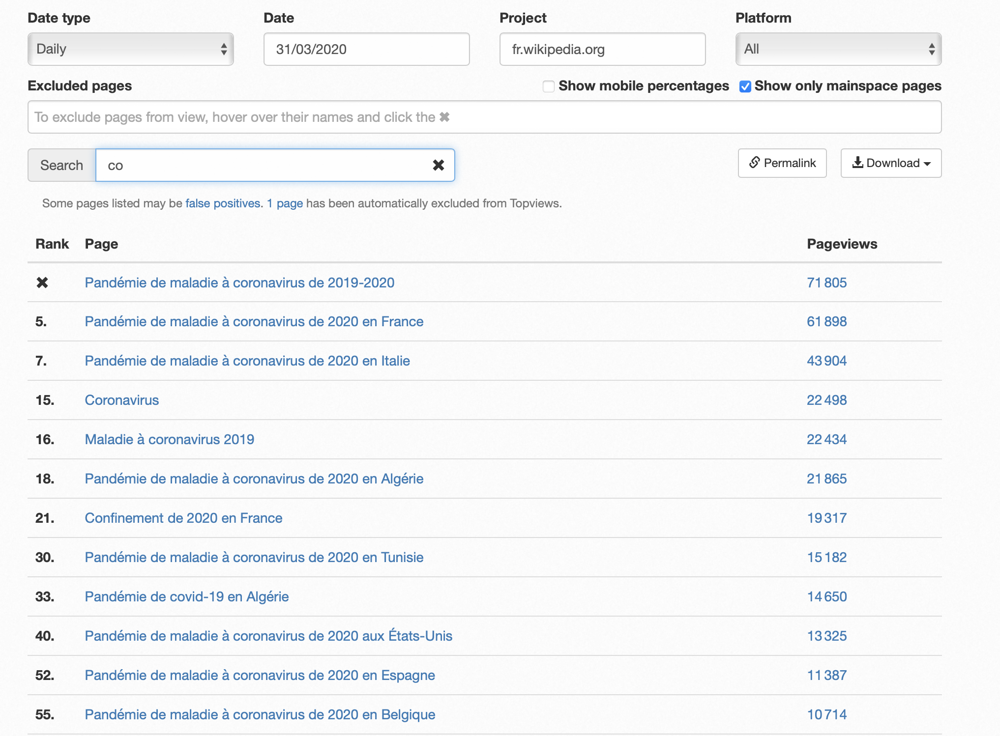

# Digital propagation of the COVID-19 pandemic

## Abstract 

It is reasonable to assume that Wikipedia searches reflect interest, as users must actively want to know more about a subject to search it on Wikipedia. Using this hypothesis, we seek to assess the “digital” propagation of the COVID-19 pandemic by looking at the pageview statistics of COVID-related pages across different languages and comparing this to the geographical propagation of the virus. We can thus link the “mental” and physical presence of the virus across countries and analyse how it impacted measures taken by the governments and the mobility of the populations.  Did populations that were strongly interested in COVID-19 restrict their mobility more? In a second stage, we are going to do an in-depth analysis of a select few countries and compare the populations interest and mobility to their trust of their government. Do interested populations trust their government and scientists more? 

## Research questions
<ol align="justify">
    <li>How did the physical propagation of the COVID-19 pandemic affect the interest of people about COVID-19 measured using Wikipedia pageviews of articles related to COVID-19?</li>
    <li>Did the interest of populations toward COVID-19 impact the measures taken by governments and does it reflect in the mobility?</li>
    <li>Will people that are more or less confident about their politics look more, or less at COVID-related Wikipedia pages? Does this reflect in their mobility during lockdowns?</li>
</ol>

## Datasets
<ol align="justify">
    <li><strong>Full CoronaWiki article list</strong>. We plan to analyze more countries that the dataset provided in the ADA course. Shay Nowick, Sr. Data Scientist at Wikimedia Foundation, provided us the full dataset: it contains all COVID-related article titles in 175 languages. The COVID-related articles were identified using the pagelinks to the articles "COVID-19" or "COVID-19 Pandemic". Before receiving the dataset, we started building a script to scrape all the information from Wikipedia. See the incomplete pipeline in <strong> FILE NAME HERE </strong>. 
    We also considered depreciated articles that redirect to COVID-related articles that were not present in the initial list because the data using the original dataset was underestimating the number of page views by a factor 10 at most (see in JupyterNoteBook the study case of the french language).
    <ul align="justify">
        <li>Languages with less than 10 articles are removed: 60 remaining languages.</li>
        <li>Languages that are not specific to a country (ex. English, Spanish) are removed in a second phase: <strong>À compléter</strong> remaining languages.</li>
        <li>We will then use the articles titles of this dataset to download all pageviews statistics using the Wikipedia REST API and thus create the dataset needed to answer our research questions.</li>
    </ul></li>
    <li><a href="https://www.google.com/covid19/mobility/"><strong>Google Mobility</strong></a>: Provided in the scope of the ADA course, this dataset contains a mobility score for every country categorized by 6 different places. We will extract the data for our countries of interests in which we seek to analyze the mobility behavior.</li>
    <li><a href="https://ourworldindata.org/trust"><strong>Population Trust</strong></a>: <strong>à compléter</strong></li>
    <li><a href="https://ourworldindata.org/explorers/coronavirus-data-explorer"><strong>COVID-19 Dataset</strong></a>: This dataset contains all information relative to the COVID-19 pandemic in the form of a timeseries per country. We will only use the cases per country and the deaths per country.</li>
</ol>

## Methods
### 1. Data scraping, pre-processing and dataframes creation
<ul align="justify">
    <li>Dataset pageview_df: we used the dataset of all COVID-related article titles in 175 languages to scrape the pageview statistics using the REST API provided by Wikipedia.   When exploring our original dataset and the list above, we saw that some important articles were not considered. Indeed, articles no longer used at the time of the original analysis were not considered because these articles only redirected on other covid related pages and have no content anymore. However at the beginning of the pandemic, these articles linked to Covid-19 main pages and were viewed a lot. Using Topviews Analysis tool of wikidata(https://pageviews.wmcloud.org/topviews/?project=fr.wikipedia.org&platform=all-access&date=2020-03-31&excludes=) we found for example that for the french language the following 12 pages are obviously related to covid but not all of them are present in the list of covid articles because most of them have been depreciated and now redirect to other pages. For example, Pandémie de maladie à coronavirus de 2020 en France redirect to Pandémie de COVID-19 en France. Thus, not considering this pages can lead to a biased analysis of the interest for Covid-19 as it can be well under-estimated.
    </li>

    <ul>
        <li>All languages that had less than 10 articles were discarded for being unsignificant.
        </li>
        <li>In addition, only languages that were associated with a geographical country were kept (ex. Swedish).
        </li>
        <li>We aggregated pageviews per language for our final DataFrame used in further analysis.
        </li>
        <li>Before the Wikimedia Foundation provided us the COVID-related article titles dataset, we set up our own script to scrape all COVID-19 related titles. See <strong>file_name</strong> for incomplete script.
        </li>
    </ul>
    </li> 
    <li>Dataset mobility_df: Google mobility dataset from different countries. We again did not use the dataset provided in the course but downloaded an enriched version directly from Google to include more countries.
    </li>
    <li>Dataset trust_df: <strong>à compléter</strong>
    </li>
    <li>Dataset covid_df: dataset with COVID cases and deaths per country.
    </li>
    
</ul>

### 2. First visualizations of COVID cases, deaths and COVID-related pageviews
<ul align="justify">
    <li>Plots of evolutions of cases, deaths and pageviews.
    </li>
    <li>Creation of interactive maps of COVID cases, of COVID death and of COVID-related articles pageviews.
    </li>
    <li>Using differences in differences analysis to numerically compare the data. And comparing the evolutions to the pre-covid baseline.
    </li>
</ul>

### 3. Identification of interesting countries to analyze
<ul align="justify">
    <li>Pearson correlation of COVID cases and COVID-related articles pageviews, and COVID deaths and COVID-related articles pageviews.
    </li>
    <li>Use unsupervised clustering methods to identify countries in which populations were highly interested in information regarding COVID-19, and identifying countries in which the correlation was similar (highly positive, negative or no correlation). From there, we will pick a representative sample of 3 to 5 countries to analyze in more depth.
    </li>
</ul>

### 4. Investigation of mobility and trust in select countries
<ul align="justify">
    <li>Question the mobility_df to identify links between information seeking behavior and mobility during the covid period. We seek to answer the question: Do countries in which the population was more interested in COVID have earlier, longer and stricter lockdowns? Do interested populations restrict their mobility more? Using pearson correlation and visual plots.
    </li>
    <li>Investigate the trust_df to identify links between information seeking behavior and trust of the population towards their government or the scientific community.
    </li>
</ul>

### 5. Site building and Datastory

## Timeline
Internal Milestones V1:
1. Week 8 : Milestone 2 deadline: scraping and data wrangling pipelines
2. Weeks 9 & 10 : Homework 2,
3. Week 11 : Mappings of the propagation done, begin analysis and deep-dive,
4. Week 12 : Macro-analysis of countries done, deep-dive into select countries,
5. Week 13 : Deep-dive finished, begin to create website and write datastory,
6. Week 14 : Cleaning of code, proofread of writing and submission of project.

## Organisation within the team

We are using ZenHub to create and track our issues effectively. As this project is about continuous exploration, we'll be using the Kanban methodology. We'll discuss, prioritize, distribute, and reassess the issues during our weekly meetings.
Team members will be free to participate in all different tasks depending on priority of said tasks. General distribution is as follows, but is neither final nor exclusive:
<ol>
  <li>Data pipelines and data wrangling: Robin & Carl,</li>
  <li>Data visualization and analysis methods: Arthur & Charlotte,</li>
  <li>Data analysis: All,</li>
  <li>Trust dataset: Charlotte,</li>
  <li>Mobility dataset: Arthur,</li>
  <li>Building site: Robin & Carl,</li>
  <li>Final redaction: All.</li>
</ol>
<strong>Commentaire : ajoutez-vous où vous voulez</strong>

## Question for the TA
